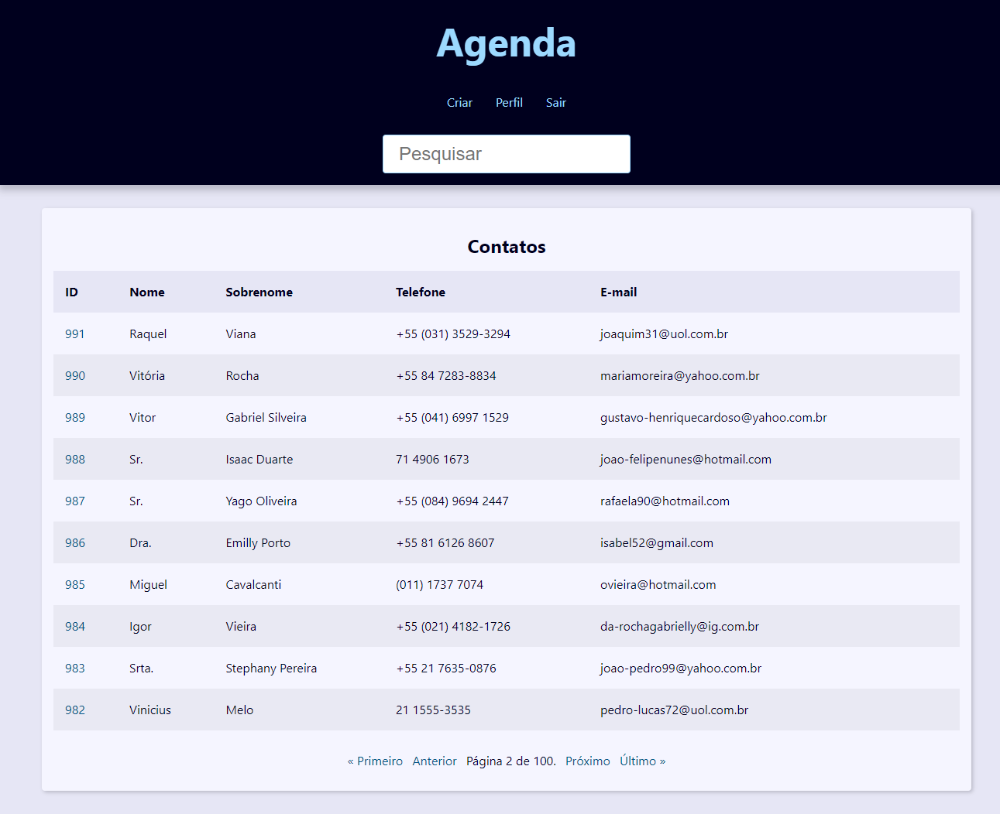
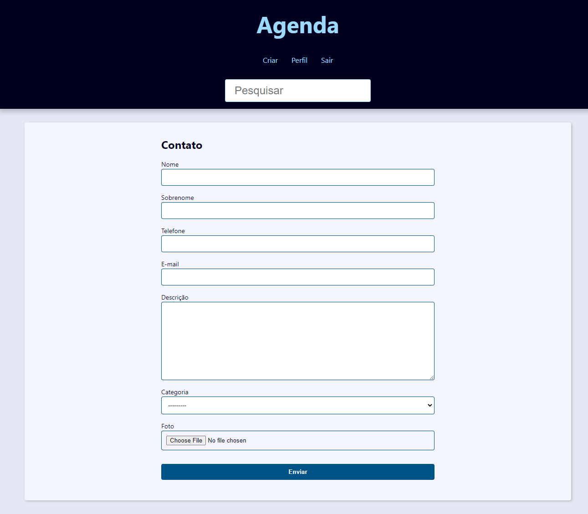
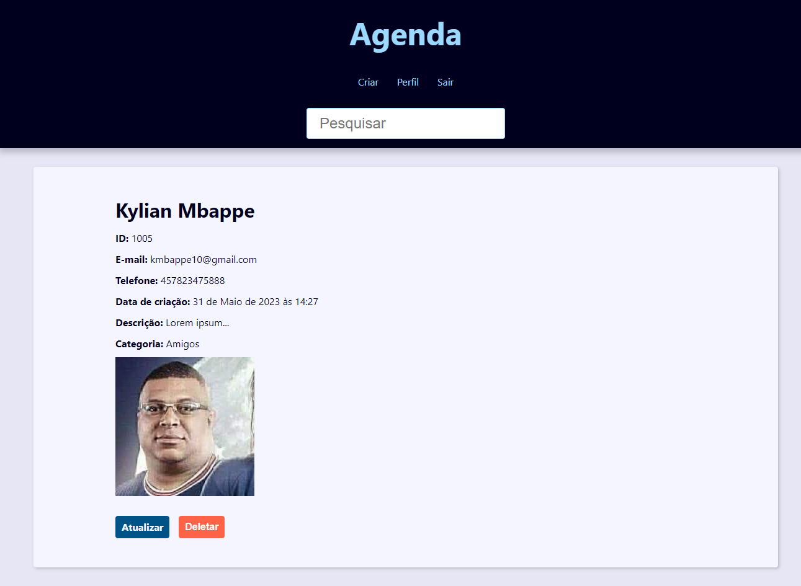

# ❤ Django Agenda

Aplicação web para gerenciar contatos.

## 🖼️ Imagens

## ⚙ Funcionalidades
- Login e logout de usuário.
- Paginamento de contatos.
- CRUD completo para contatos criados pelo mesmo usuário logado.
- Possibilidade de enviar uma imagem para o contato.

## 🛠 Tecnologias
- Python
- Django
